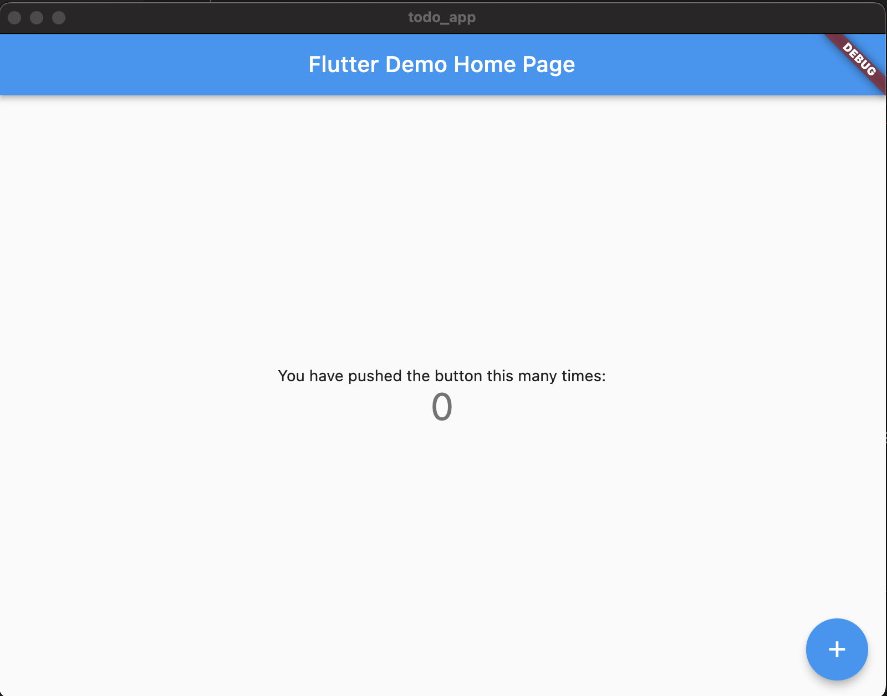
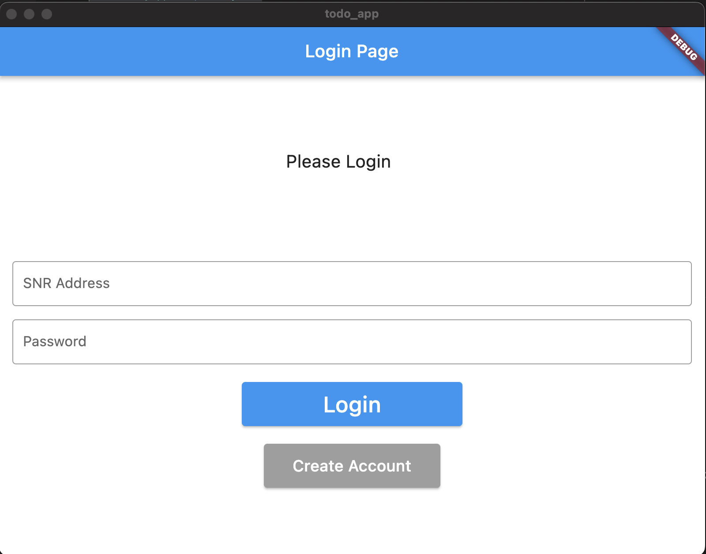
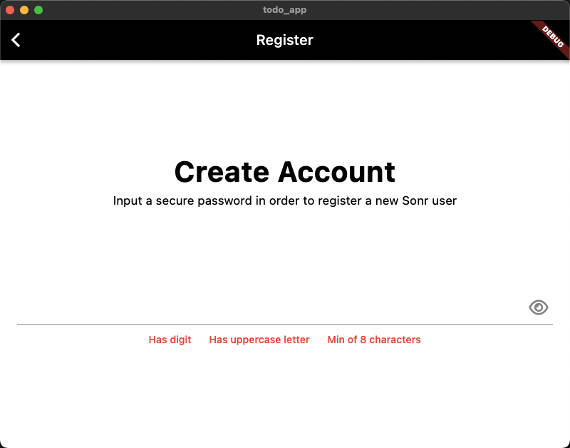

Building apps has never been easier, especially today with tools like Flutter. 
You can build apps in minutes.

<!--{/* TODO: Add flavor to opening *} -->
Let's Build a simple Flutter To Do app.

To start, make sure you have [Flutter installed](https://docs.flutter.dev/get-started/install).
If you're on MacOS, you can run `brew install --cask flutter` to install it.  

:::tip

You can check that Flutter successfully installed with Flutter doctor:

```bash title="terminal"
flutter doctor
```

If you run into installation issues, we suggest checking out [stack overflow](https://stackoverflow.com/search?q=flutter+install)!
:::

:::tip
You can open this repo in GitPod to follow along with this tutorial.
gitpod.io/#/github.com/ntindle/todo_app
:::

## Creating a new project
To create a new project, run the following command:

```bash title="terminal"
flutter create todo_app
```

Now you can open the project in your favorite editor.
Then, we will run it and make sure it works.

```bash title="terminal"
cd todo_app
flutter run
```

You should see a screen like this:
[](https://youtu.be/1gDhl4leEzA)
> Note: this screenshot is from MacOS, yours may look different depending on the platform you're using.

## Adding motor_flutter
Next, we'll need to add the `motor_flutter` package to our project.
To do this, we will use the `flutter pub add` command.

```bash title="terminal"
flutter pub add motor_flutter
```

Then, checking the `pubspec.yaml` file, you should see the following:

```yaml title="pubspec.yaml"
dependencies:
  flutter:
    sdk: flutter
  cupertino_icons: ^1.0.2
  motor_flutter: ^0.3.4
```

> Note, your version may be different depending on when you read this. Check the [motor-flutter pub.dev page](https://pub.dev/packages/motor_flutter) for the latest version.

To finish setting up on iOS, we need to make the following changes:

1. Open `ios/Podfile` and add the following line to the top of the file:

  ```ruby title="ios/Podfile"
  platform :ios, '13.0'
  ```
  > Note: the 13.0 is the minimum version of iOS that motor_flutter supports.

2. Remove the `use_frameworks!` line from the `Podfile`.

  It should look like this:

  ```ruby title="ios/Podfile"
  # ...
  target 'Runner' do
    # Remove this next line
    use_frameworks!
    # ...
  end
  # ...
  ```

## Initializing motor_flutter
Now that we have the package installed, we can initialize it.
To do this, we want to import it in our `main.dart` file.

```dart title="lib/main.dart"
import 'package:motor_flutter/motor_flutter.dart';
```

Then, we can initialize it in the `main` function:

```dart title="lib/main.dart"
void main() {
  void handleMotorInitResponse(InitializeResponse? response) {
    if (response != null) {
      print('Motor initialized');
      print(response);
    }
  }
  MotorFlutter().init(handleMotorInitResponse);
  runApp(MyApp());
}
```
You may notice it takes a while to load, keep reading, theres a problem with the above and it never will load.

I prefer to use GetX to manage my state, so let's will make a few changes first.

1. Add the `get` package to our project:

  ```bash title="terminal"
  flutter pub add get
  ```

2. Import the `get` package in our `main.dart` file:

  ```dart title="lib/main.dart"
  import 'package:get/get.dart';
  ```

3. Change the `MyApp` class to return `GetMaterialApp` instead of `MaterialApp`:

  ```dart title="lib/main.dart"
  class MyApp extends StatelessWidget {
    const MyApp({super.key});
  
    // This widget is the root of your application.
    @override
    Widget build(BuildContext context) {
    // This next line is the only change
      return GetMaterialApp(
        title: 'Flutter Demo',
        theme: ThemeData(
          // This is ...
          primarySwatch: Colors.blue,
        ),
        home: const LoginPage(title: "Login here"),
      );
    }
  }
  ```

### Fixing the initialization

1. Change the `main` function to use `Future<void>` instead of `void`:
  > This allows us to use `async` and `await` in the function.

  ```dart title="lib/main.dart"
  Future<void> main() async {
   // ...
    }
  ```
2. Initialize the `MotorFlutter` class in the `main` function using `Get`:

  ```dart title="lib/main.dart"
  Future<void> main() async {
    // Don't worry about this line just yet
    WidgetsFlutterBinding.ensureInitialized();
    // handle the motor initialization response
    void handleMotorInitResponse(InitializeResponse? response) {
      if (response != null) {
        print('Motor initialized');
        print(response);
      }
    }
  
    MotorFlutter motor = // <-- this is the important line
        Get.put(MotorFlutter(), permanent: true); // <-- this is the important line
    motor.init(handleMotorInitResponse); // <-- this is the important line
  
    runApp(const MyApp()); // <-- Added const here to keep vs code happy
  }
  ```

:::tip
The `Get.put` function is used to initialize a class and make it available to the entire app.
The `permanent: true` parameter makes sure the class is not destroyed when the widget is removed from the tree.
:::

You should see something along the lines of the following in your console:
    
```bash title="flutter log output"
flutter: Motor initialized
flutter: success: true
```

## Adding a login page
Now that we have motor initialized, we can add a login page.
To do this, we will make a new page and add a button to navigate to it.

1. Create a new file called `login_page.dart` in the `lib` folder.
1. Change `main.dart` to import the new file:

  ```dart title="lib/main.dart"
  import 'package:motor_flutter/motor_flutter.dart';
  import 'login_page.dart'; // <-- this is the new line
  ```
1. Swap the home of the application to your login page.
  ```dart title="lib/main.dart"
    class MyApp extends StatelessWidget {
    const MyApp({super.key});
  
    // This widget is the root of your application.
    @override
    Widget build(BuildContext context) {
      return GetMaterialApp(
        title: 'Flutter Demo',
        theme: ThemeData(
          // This is the theme ...
          primarySwatch: Colors.blue,
        ),
        home: const LoginPage(title: 'Flutter Demo Home Page'), // <-- this is the changed line
      );
    }
  }
  ```
1. Add the following UI Code to the file.

:::tip
This site has a neat feature where you can hover over the code block and a copy button will appear.

A line wrap button also appears. It would be wise to use it here.
:::

```dart title="lib/login_page.dart"
import 'package:flutter/material.dart';
import 'package:get/get.dart';
import 'package:motor_flutter/motor_flutter.dart';

class LoginPage extends StatefulWidget {
  const LoginPage({super.key, required this.title});

  final String title;

  @override
  State<LoginPage> createState() => _LoginPageState();
}

class _LoginPageState extends State<LoginPage> {
  TextEditingController addressController = TextEditingController();
  TextEditingController passwordController = TextEditingController();

  void _handleLoginResponse(LoginResponse? resp) {
    if (resp != null && resp.success) {
      // Login successful
      print(resp);
    } else {
      // Login failed
    }
  }

  void _login() {
      // TODO: Add login logic
      print(addressController.text);
      print(passwordController.text);
  }

  @override
  Widget build(BuildContext context) {
    return Scaffold(
      backgroundColor: Colors.white,
      appBar: AppBar(
        title: const Text("Login Page"),
      ),
      body: SingleChildScrollView(
        child: Column(
          children: <Widget>[
            Padding(
              padding: const EdgeInsets.only(top: 60.0),
              child: Center(
                child: Container(
                    width: 200,
                    height: 150,
                    padding: const EdgeInsets.all(25),
                    child: const Text("Please Login",
                        style: TextStyle(fontSize: 20))),
              ),
            ),
            Padding(
              padding: const EdgeInsets.symmetric(horizontal: 15),
              child: TextField(
                controller: addressController,
                decoration: const InputDecoration(
                    border: OutlineInputBorder(),
                    labelText: 'SNR DID Address',
                    hintText: 'Enter valid DID as did:snr:aksldjfenkjaof29oi'),
              ),
            ),
            Padding(
              padding: const EdgeInsets.only(
                  left: 15.0, right: 15.0, top: 15, bottom: 0),
              child: TextField(
                controller: passwordController,
                obscureText: true,
                decoration: const InputDecoration(
                    border: OutlineInputBorder(),
                    labelText: 'Password',
                    hintText: 'Enter your secure password'),
              ),
            ),
            Container(
              height: 50,
              width: 250,
              margin: const EdgeInsets.only(top: 20),
              decoration: BoxDecoration(
                  color: Colors.blue, borderRadius: BorderRadius.circular(20)),
              child: ElevatedButton(
                onPressed: () => _login(),
                child: const Text(
                  'Login',
                  style: TextStyle(color: Colors.white, fontSize: 25),
                ),
              ),
            ),
            Container(
              height: 50,
              width: 200,
              margin: const EdgeInsets.only(top: 20),
              child: ElevatedButton(
                style: ElevatedButton.styleFrom(
                  backgroundColor: Colors.grey,
                ),
                onPressed: () => Get.defaultDialog(
                    title:
                        "You pressed the Create Account button, but it's not implemented yet"),
                child: const Text(
                  'Create Account',
                  style: TextStyle(color: Colors.white, fontSize: 18),
                ),
              ),
            ),
          ],
        ),
      ),
    );
  }
}
```
It should look something like this:



If you attempt to use the Login button, you will see something like the following in the console:
```bash title="flutter log output"
flutter: adsfs
flutter: aasdfasdf
```

Before we can login though, we need to create an account.
We will do this in the next section.

First, let's walk through the code above.

### Login Page Widget

```dart title="lib/login_page.dart"
class LoginPage extends StatefulWidget {
  const LoginPage({super.key, required this.title});

  final String title;

  @override
  State<LoginPage> createState() => _LoginPageState();
}
```
All this is doing is creating a page and attaching a state to it.

### Login Page State

```dart title="lib/login_page.dart"
class _LoginPageState extends State<LoginPage> {
  TextEditingController addressController = TextEditingController();
  TextEditingController passwordController = TextEditingController();

  void _login() {
      // TODO: Add login logic
      print(addressController.text);
      print(passwordController.text);

  }
  //...
}
```
This is where we store the state of the login page. We also defined a couple functions to help us out. 

#### Login Function
```dart title="lib/login_page.dart"
  void _login() {
      // TODO: Add login logic
      print(addressController.text);
      print(passwordController.text);
  }
```
This is the function that will be called when the user presses the login button.
It will print the text in the text fields to the console.
Later on, we will replace this with the actual login logic.


#### build
```dart title="lib/login_page.dart"
@override
Widget build(BuildContext context) {
  // 1. This is the scaffold that will hold the page.
  return Scaffold(
    backgroundColor: Colors.white,
    appBar: AppBar(
      title: const Text("Login Page"),
    ),
    // 2. This is the body of the page. 
    // All of our content will go within it.
    // The visible item is the "Please Login" text.
    body: SingleChildScrollView(
      child: Column(
        children: <Widget>[
          Padding(
            padding: const EdgeInsets.only(top: 60.0),
            child: Center(
              child: Container(
                  width: 200,
                  height: 150,
                  padding: const EdgeInsets.all(25),
                  child: const Text("Please Login",
                      style: TextStyle(fontSize: 20))),
            ),
          ),
          // 3. This is the text field for the SNR DID Address.
          Padding(
            padding: const EdgeInsets.symmetric(horizontal: 15),
            child: TextField(
              controller: addressController,
              decoration: const InputDecoration(
                  border: OutlineInputBorder(),
                  labelText: 'SNR DID Address',
                  hintText: 'Enter valid DID as did:snr:aksldjfenkjaof29oi'),
            ),
          ),
          // 4. This is the text field for the password.
          Padding(
            padding: const EdgeInsets.only(
                left: 15.0, right: 15.0, top: 15, bottom: 0),
            child: TextField(
              controller: passwordController,
              obscureText: true,
              decoration: const InputDecoration(
                  border: OutlineInputBorder(),
                  labelText: 'Password',
                  hintText: 'Enter your secure password'),
            ),
          ),
          // 5. This is the login button.
          // This is where we call the _login function.
          Container(
            height: 50,
            width: 250,
            margin: const EdgeInsets.only(top: 20),
            decoration: BoxDecoration(
                color: Colors.blue, borderRadius: BorderRadius.circular(20)),
            child: ElevatedButton(
              onPressed: () => _login(),
              child: const Text(
                'Login',
                style: TextStyle(color: Colors.white, fontSize: 25),
              ),
            ),
          ),
          // 6. This is the create account button. 
          // The Create Account button has a dialog attached to it. 
          // This is just a placeholder for now.
          Container(
            height: 50,
            width: 200,
            margin: const EdgeInsets.only(top: 20),
            child: ElevatedButton(
              style: ElevatedButton.styleFrom(
                backgroundColor: Colors.grey,
              ),
              onPressed: () => Get.defaultDialog(
                  title:
                      "You pressed the Create Account button, but it's not implemented yet"),
              child: const Text(
                'Create Account',
                style: TextStyle(color: Colors.white, fontSize: 18),
              ),
            ),
          ),
        ],
      ),
    ),
  );
}
```
This is the `build` function.
It's where we do the bulk of page layout. 
I've broken it down into numbered sections to make it easier to follow.
You should be able to match each of the sections to the image above.


## Creating an account
Now that we have a login page, we need to be able to create an account.
To do this, we will utilize the `showRegisterModal` that exists within the `motor_flutter` package.
1. Change `lib/login_page.dart`'s `Create Account` button to navigate to the new page.
  At the same time, we also add an `onPressed` function that will call `showRegisterModal` that will handle the registration for us.
  You should still have the container around the `MaterialButton` widget.
  ```dart title="lib/login_page.dart"
  //...
  MaterialButton(
    color: Colors.white,
    child: const Text('Register Account'),
    // --
    // 2. Add the RegisterAccount ModalView on tap
    // --
    onPressed: () async {
      Get.put(RegisterController());
      final res =
          await MotorFlutter.to.showRegisterModal(onError: (err) {
        Get.snackbar("Error", err.toString());
      });
      if (res != null) {
        // Store the address in the controller???
        Get.offAll(() => const LoginPage(title: "Login"));
      }
    },
  ),
  ```
  When you load this and click the button now, you should see the registration modal.
  

  Once we register the user, we push them back to the login page.
  However, the login page asks for their DID address and password.

2. The user doesn't know their DID address yet, so we should pull it from memory and prefill it for them.
  ```dart title="lib/login_page.dart"
  class _LoginPageState extends State<LoginPage> {
  TextEditingController addressController =
      TextEditingController(text: Get.find<MotorFlutter>().address.toString());
  TextEditingController passwordController = TextEditingController();
  //...
  }
  ```
  Using `Get`, which we setup eariler, we cna find the `MotorFlutter` controller and pull the `didUrl` from it.
  We then convert the `didUrl` to a string and pass it to the `addressController`'s `text` property.
  This will prefill the address field for the user.
  :::tip
  If you wanted to be smarter about this, you can check if the didUrl returned is the default `did:snr:abc123` and only prefill if it's not.

  That way if the user has already registered, it won't prefill the address field with nonsense they have to delete first.
  :::

## Logging in
Now that we have a login page and a way to create an account, we need to be able to log in.
We just have to fill out the `_login` function from earlier and we should be good to go.

### Calling the `.login` function on `MotorFlutter`
The `MotorFlutter` controller has a `.login` function that we can call to log in.
We just need to pass it the DID address and password.
```dart title="lib/login_page.dart"
void _login() async {
  print("logging in");
  final res = await Get.find<MotorFlutter>()
      .login(password: passwordController.text, address: addressController.text);
  if (res != null) {
    print(res);
  } else {
    print('Login failed');
  }
}
```

### Handling the response
The `.login` function returns a `LoginResponse` object.
If you look at the [documentation](https://motor.build/motor_flutter/LoginResponse-class.html) for the `LoginResponse` object, you'll see that it has a `success` property.
If the login was successful, this will be `true`.
If it was not successful, it will be `false`.
We can use this to determine if the login was successful or not.
```dart title="lib/login_page.dart"
void _login() async {
  print("logging in");
  final res = await Get.find<MotorFlutter>()
      .login(password: passwordController.text, address: addressController.text);
  if (res != null) {
    if (res.success) {
      print('Login successful');
    } else {
      print('Login failed');
    }
  } else {
    print('Login failed');
  }
}
```
Above, we print if it was successful, but you should probably do something more useful than that.
Lets change the `print` to a `Get.snackbar` so the user can see the result of their login attempt.
```dart title="lib/login_page.dart"
void _login() async {
  print("logging in");
  final res = await Get.find<MotorFlutter>()
      .login(password: passwordController.text, address: addressController.text);
  if (res != null) {
    if (res.success) {
      Get.snackbar("Login", "Login successful");
    } else {
      Get.snackbar("Login", "Login failed");
    }
  } else {
    Get.snackbar("Login", "Login failed");
  }
}
```
Now, when you login, you should see a snackbar at the bottom of the screen telling you if it was successful or not.
Additonally, if the login was successful, we should push them towards the app we were supposed to be building this whole time.
We can do this by calling `Get.offAll` and passing it the `MyHomePage` widget (Someone should probably rename `MyHomePage` to `HomePage`, but it won't be me.)
```dart title="lib/login_page.dart"
void _login() async {
  final res = await Get.find<MotorFlutter>()
      .login(password: passwordController.text, address: addressController.text);
  if (res != null) {
    if (res.success) {
      Get.snackbar("Login", "Login successful");
      Get.offAll(() => const MyHomePage(title: "Home"));
    } else {
      Get.snackbar("Login", "Login failed");
    }
  } else {
    Get.snackbar("Login", "Login failed");
  }
}
```