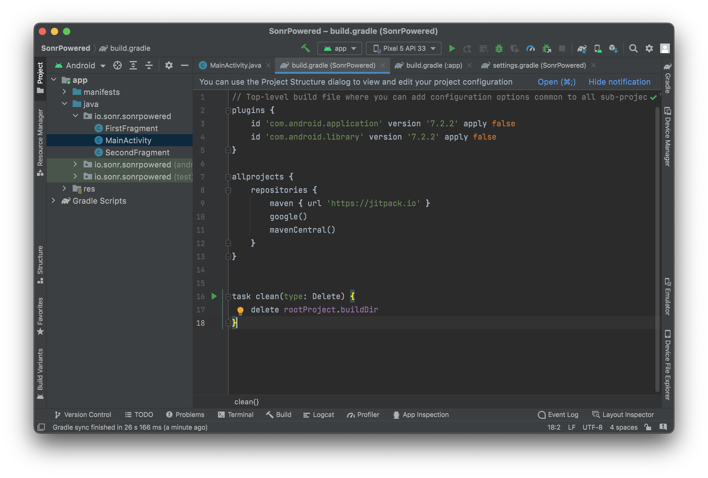

# Getting Started

This guide assumes you're familiar with Android development and [Android Studio](https://developer.android.com/studio/intro).

Start by creating a new project. 

Next, grab the latest version of Motoroid from [Jitpack.io](https://jitpack.io/#sonr-io/motor-android). Select the "motoroid" subproject and follow the instructions to finish adding the dependency.

Your `build.gradle` should look like this when you're done.
